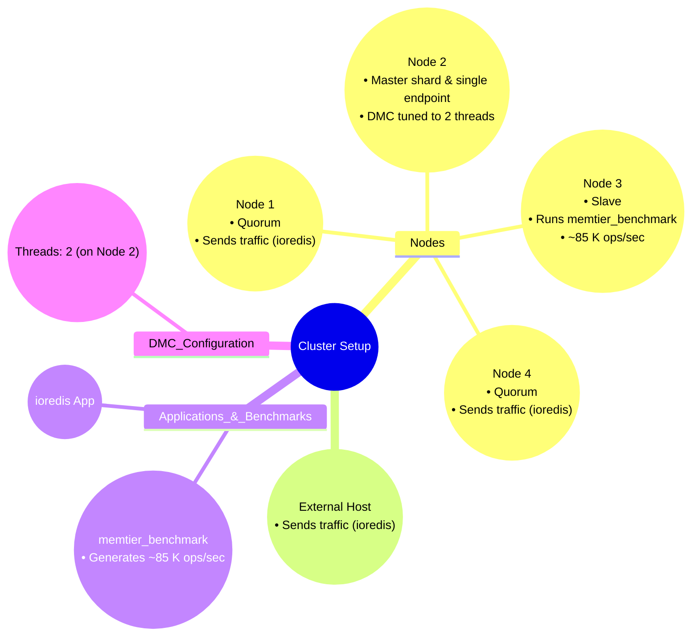

```mermaid
mindmap
  root((Cluster Setup))
    Nodes
      Node1(("Node 1
      • Quorum
      • Sends traffic (ioredis)"))
      Node2(("Node 2
      • Master shard & single endpoint
      • DMC tuned to 2 threads"))
      Node3(("Node 3
      • Slave
      • Runs memtier_benchmark
      • ~85 K ops/sec"))
      Node4(("Node 4
      • Quorum
      • Sends traffic (ioredis)"))
    ExternalHost(("External Host
      • Sends traffic (ioredis)"))
    Applications_&_Benchmarks
      ioredisApp(("ioredis App"))
      memtierBenchmark(("memtier_benchmark
      • Generates ~85 K ops/sec"))
    DMC_Configuration
      Threads(("Threads: 2 (on Node 2)"))
```
